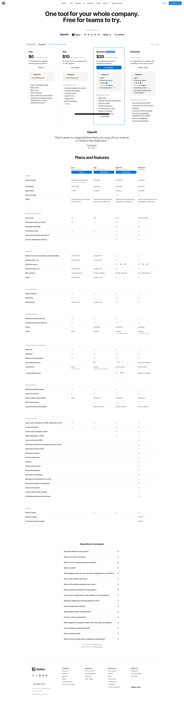

# 🎯 Competitor Hunter

> **AI 驱动的竞品分析智能体** | 使用 MCP、LangGraph 和 Playwright 进行自动化网页抓取和结构化数据提取

[](https://opensource.org/licenses/MIT)
[](https://www.python.org/downloads/)
[](https://github.com/psf/black)

**语言 | Language**: [中文](README.zh.md) | [English](README.md)

---

## 📖 简介

**Competitor Hunter** 是一个生产就绪的 AI 智能体，通过抓取产品页面并使用大语言模型提取结构化信息来自动化竞品分析。基于 **模型上下文协议 (MCP)** 构建，可与 Claude Desktop 和其他 MCP 兼容客户端无缝集成。

### 核心能力

- 🔍 **智能网页抓取**: 具有反检测功能的自动化浏览器内容提取
- 🤖 **LLM 驱动提取**: 使用 OpenAI 兼容 API 进行结构化数据提取
- 📊 **结构化输出**: Pydantic 验证的产品信息（定价、功能、SWOT 分析）
- 🔄 **LangGraph 工作流**: 强大的状态管理和错误处理
- 🔌 **MCP 集成**: 原生支持 Claude Desktop 和 MCP 客户端

---

## 🏗️ 架构

系统采用 **六边形架构**，清晰的关注点分离。工作流程：用户请求 → MCP 服务器 → LangGraph 工作流 → 浏览器抓取 → LLM 提取 → 返回结构化数据。

---

## ✨ 核心特性

- **🤖 AI 驱动**: 使用 LLM 进行智能提取，自动生成 SWOT 分析
- **📊 结构化输出**: Pydantic 验证的数据模型，包含定价、功能、摘要
- **🛡️ 反检测机制**: 随机 User-Agent、智能滚动、自动截图
- **🔌 MCP 原生**: 与 Claude Desktop 和 Cursor IDE 无缝集成
- **📦 CLI 工具**: 专业的命令行界面，支持批量分析
- **异步编程**: 完整的异步编程以获得最佳性能

---

## 🚀 快速开始

### 前置要求

- **Python 3.10+**（推荐 3.11 或 3.12）
- **UV** 或 **Poetry**（依赖管理器）
- **Playwright** 浏览器（自动安装）

### 安装步骤

1. **克隆仓库**:
   ```bash
   git clone https://github.com/your-username/competitor-hunter.git
   cd competitor-hunter
   ```

2. **安装依赖** (使用 UV):
   ```bash
   uv sync
   ```

   或使用 Poetry:
   ```bash
   poetry install
   ```

   或使用 pip:
   ```bash
   python -m venv venv
   source venv/bin/activate  # Windows: venv\Scripts\activate
   pip install -e ".[dev]"
   ```

3. **安装 Playwright 浏览器**:
   ```bash
   playwright install chromium
   ```

### 配置

在项目根目录创建 `.env` 文件:

```env
# OpenAI API 配置
OPENAI_API_KEY=your_openai_api_key_here
OPENAI_BASE_URL=https://api.openai.com/v1  # 可选: 自定义端点
OPENAI_MODEL_NAME=gpt-4o                    # 可选: 默认为 gpt-4o

# 浏览器配置
HEADLESS_MODE=true                          # 调试时设置为 false

# 数据库配置
DB_PATH=data/competitors.db                 # SQLite 数据库路径
```

💡 **提示**: 复制 `.env.example` 到 `.env` 并填写您的值:

```bash
cp .env.example .env
```

---

## 📸 截图展示与示例

### 分析结果截图


*Notion 定价页面分析截图*

### CLI 输出示例

```bash
$ competitor-hunter https://www.notion.so/pricing
🔍 正在分析: https://www.notion.so/pricing

✅ 分析完成！

======================================================================
📦 产品名称: Notion
🔗 URL: https://www.notion.so/pricing
🕒 更新时间: 2024-06-13 00:00:00+00:00
======================================================================

💰 定价方案 (4 个):
   • Free: 0 USD / monthly
   • Plus: 10 USD / monthly
   • Business: 20 USD / monthly
   • Enterprise: Custom USD / custom

✨ 核心功能 (13 个):
   1. AI 自动化
   2. 企业搜索
   3. 会议记录
   ...

💾 结果已保存到: reports/product_Notion.json
```

### JSON 输出结构

分析结果以结构化 JSON 文件保存：

```json
{
  "product_name": "Notion",
  "url": "https://www.notion.so/pricing",
  "pricing_tiers": [
    {
      "name": "Free",
      "price": "0",
      "currency": "USD",
      "billing_cycle": "monthly"
    },
    {
      "name": "Plus",
      "price": "10",
      "currency": "USD",
      "billing_cycle": "monthly"
    }
  ],
  "core_features": [
    "AI 自动化",
    "文档编辑",
    "知识库"
  ],
  "summary": "## 产品概述\nNotion 是一款集文档编辑...",
  "last_updated": "2024-06-13T00:00:00Z"
}
```

---

## 📚 使用方法

### 方式一：CLI 命令（最简单）

安装后，使用 `competitor-hunter` 命令：

```bash
# 分析单个网站
competitor-hunter https://www.notion.so/pricing

# 指定输出文件
competitor-hunter https://example.com output.json

# 批量分析
competitor-hunter https://site1.com https://site2.com https://site3.com
```

分析结果会自动保存到 `reports/` 目录，使用正确的 UTF-8 编码。

### 方式二：MCP 服务器模式（推荐用于 AI 助手）

运行 MCP 服务器以启用与 Claude Desktop 或 Cursor 的集成：

```bash
python -m src.competitor_hunter.interface.mcp_server.server
```

#### Claude Desktop 集成

将以下配置添加到您的 Claude Desktop `claude_desktop_config.json`：

**macOS**: `~/Library/Application Support/Claude/claude_desktop_config.json`  
**Windows**: `%APPDATA%\Claude\claude_desktop_config.json`

```json
{
  "mcpServers": {
    "competitor-hunter": {
      "command": "python",
      "args": [
        "-m",
        "src.competitor_hunter.interface.mcp_server.server"
      ],
      "cwd": "/path/to/competitor-hunter"
    }
  }
}
```

#### Cursor IDE 集成

在项目根目录创建 `.cursor/mcp.json`：

```json
{
  "mcpServers": {
    "competitor-hunter": {
      "command": "python",
      "args": [
        "-m",
        "src.competitor_hunter.interface.mcp_server.server"
      ],
      "cwd": "${workspaceFolder}"
    }
  }
}
```

重启后，您可以在聊天中直接使用：

```
分析这个竞品：https://www.notion.so/pricing
```

### 方式三：Python 库

在 Python 代码中直接使用 LangGraph 工作流：

```python
import asyncio
from competitor_hunter.core import graph, AgentState, cleanup_resources

async def analyze(url: str):
    # 初始化状态
    initial_state: AgentState = {
        "url": url,
        "scraped_content": None,
        "product": None,
        "error": None,
    }
    
    # 运行工作流
    result = await graph.ainvoke(initial_state)
    
    # 检查结果
    if result.get("error"):
        print(f"错误: {result['error']}")
        return None
    
    product = result["product"]
    print(f"产品: {product.product_name}")
    print(f"定价层级: {len(product.pricing_tiers)}")
    print(f"功能: {product.core_features}")
    
    return product

# 使用
product = await analyze("https://www.notion.so/pricing")
await cleanup_resources()
```

### 输出结构

所有分析结果都保存到 `reports/` 目录：

```
reports/
├── product_Notion.json
├── product_Example_Domain.json
└── ...
```

每个 JSON 文件包含：
- 产品名称和 URL
- 定价层级（名称、价格、货币、计费周期）
- 核心功能列表
- Markdown 格式的摘要（包含 SWOT 分析）
- 最后更新时间戳

### 输出示例

```json
{
  "product_name": "Notion",
  "url": "https://www.notion.so/pricing",
  "pricing_tiers": [
    {
      "name": "Free",
      "price": "0",
      "currency": "USD",
      "billing_cycle": "monthly"
    },
    {
      "name": "Plus",
      "price": "10",
      "currency": "USD",
      "billing_cycle": "monthly"
    }
  ],
  "core_features": [
    "AI 自动化",
    "文档编辑",
    "知识库",
    "项目管理"
  ],
  "summary": "## 产品概述\nNotion 是一款集文档编辑...",
  "last_updated": "2024-06-13T00:00:00Z"
}
```

---

## 🧪 开发

### 运行测试

```bash
# 运行所有测试
pytest tests/ -v

# 运行特定测试文件
pytest tests/test_crawler.py -v

# 运行覆盖率测试
pytest tests/ --cov=src/competitor_hunter --cov-report=html
```

### 代码质量

```bash
# 格式化代码
black src/ tests/

# 代码检查
ruff check src/ tests/

# 类型检查（如果使用 mypy）
mypy src/
```

### 项目结构

```
competitor-hunter/
├── src/
│   └── competitor_hunter/
│       ├── cli.py             # CLI 命令行界面
│       ├── main.py            # 应用入口点
│       ├── config.py          # 配置管理
│       ├── core/               # 领域模型和 LangGraph 工作流
│       │   ├── models.py       # Pydantic 模型（CompetitorProduct 等）
│       │   └── graph.py        # LangGraph 工作流定义
│       ├── infrastructure/     # 外部服务
│       │   ├── browser/        # Playwright 浏览器服务
│       │   └── llm/            # LLM 提取器服务
│       └── interface/          # 入口点
│           └── mcp_server/     # MCP 服务器实现
├── config/                     # 配置文件
│   └── app.yaml.example        # 配置模板
├── docker/                     # Docker 配置
│   ├── Dockerfile              # Docker 镜像定义
│   └── docker-compose.yml     # Docker Compose 配置
├── examples/                   # 示例脚本
├── tests/                      # 测试套件
├── reports/                     # 分析结果（gitignored）
├── data/                       # SQLite 数据库（gitignored）
├── logs/                       # 截图和日志（gitignored）
├── pyproject.toml              # 项目依赖和 CLI 入口点
└── README.md                   # 英文文档
```

---

## 📦 依赖项

### 核心依赖

- **mcp**: 模型上下文协议服务器实现
- **langgraph**: 工作流编排
- **langchain**: LLM 集成框架
- **playwright**: 浏览器自动化
- **pydantic**: 数据验证和序列化
- **html2text**: HTML 到 Markdown 转换
- **loguru**: 结构化日志

### 开发依赖

- **pytest**: 测试框架
- **pytest-asyncio**: 异步测试支持
- **ruff**: 快速 Python 代码检查工具
- **black**: 代码格式化工具

---

## 🤝 贡献

欢迎贡献！请随时提交 Pull Request。

1. Fork 仓库
2. 创建功能分支 (`git checkout -b feature/amazing-feature`)
3. 提交更改 (`git commit -m '添加一些很棒的功能'`)
4. 推送到分支 (`git push origin feature/amazing-feature`)
5. 打开 Pull Request

---

## 📄 许可证

本项目采用 **MIT 许可证** - 详情请参阅 [LICENSE](LICENSE) 文件。

---

## 🙏 致谢

- 使用 [LangGraph](https://github.com/langchain-ai/langgraph) 进行工作流编排
- 使用 [Playwright](https://playwright.dev/) 进行浏览器自动化
- 集成 [模型上下文协议 (MCP)](https://modelcontextprotocol.io/) 用于 AI 智能体通信

---

## 📞 支持

如有问题、疑问或贡献，请在 [GitHub](https://github.com/your-username/competitor-hunter/issues) 上提交 issue。

---

**为竞争情报而用心打造 ❤️**

